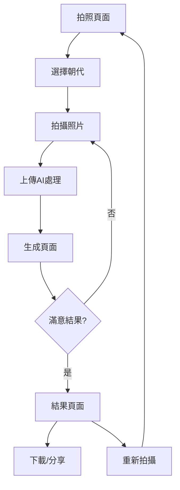

## 1. 產品概述
中華文化歷史換裝拍照應用是一個專為學校活動設計的互動網頁應用，學生可使用iPad拍攝照片，並通過AI技術將現代服裝替換為不同朝代的歷史服飾。

讓學生體驗中華歷史文化，增強對傳統服飾的認識，提供簡單易用的拍照換裝體驗。

## 2. 核心功能

### 2.1 用戶角色
本產品設計為單一用戶角色，無需註冊登錄系統，所有學生均可直接使用。

| 角色 | 使用方式 | 核心權限 |
|------|----------|----------|
| 學生用戶 | 直接訪問網頁 | 拍照、選擇朝代、生成歷史服裝、下載分享 |

### 2.2 功能模塊
我們的歷史換裝應用包含以下主要頁面：
1. **拍照頁面**：相機預覽、拍照按鈕、朝代選擇。
2. **生成頁面**：AI換裝處理、進度顯示、結果預覽。
3. **結果頁面**：歷史服裝照片展示、下載按鈕、分享功能。

### 2.3 頁面詳情
| 頁面名稱 | 模塊名稱 | 功能描述 |
|----------|----------|----------|
| 拍照頁面 | 相機預覽 | 調用iPad相機，實時顯示預覽畫面，支持前後鏡頭切換。 |
| 拍照頁面 | 拍照功能 | 點擊拍照按鈕捕捉當前畫面，自動保存到本地緩存。 |
| 拍照頁面 | 朝代選擇 | 提供唐、宋、明、清四個朝代選項，每個朝代配有代表性服飾預覽圖。 |
| 拍照頁面 | 操作指引 | 顯示簡單的操作說明，指導學生如何擺姿勢和選擇朝代。 |
| 生成頁面 | AI處理 | 將拍攝照片上傳至Qwen API，根據選擇的朝代生成對應的歷史服裝效果。 |
| 生成頁面 | 進度顯示 | 顯示圖片處理進度條，提供友好的等待體驗。 |
| 生成頁面 | 結果預覽 | 展示AI生成的歷史服裝照片，提供重新生成和確認按鈕。 |
| 結果頁面 | 照片展示 | 大圖展示最終的歷史服裝照片，支持手勢縮放查看細節。 |
| 結果頁面 | 下載功能 | 一鍵下載照片到iPad本地相冊，支持批量下載多張照片。 |
| 結果頁面 | 分享功能 | 生成分享鏈接或二維碼，方便學生間互相分享作品。 |
| 結果頁面 | 重新拍攝 | 提供返回拍照頁面的快捷入口，開始新的創作。 |

## 3. 核心流程
用戶操作流程：
1. 學生打開iPad上的網頁應用
2. 進入拍照頁面，允許相機權限
3. 調整姿勢，選擇想要體驗的歷史朝代
4. 點擊拍照按鈕拍攝照片
5. 系統自動將照片上傳至AI服務進行換裝處理
6. 等待處理完成，預覽生成的歷史服裝照片
7. 滿意後可下載保存到本地，或重新拍攝
8. 所有生成的照片會自動備份到主辦電腦

## 4. 用戶界面設計

### 4.1 設計風格
- **主色調**：中國紅 (#DC143C) 搭配金色 (#FFD700)
- **輔助色**：墨黑色 (#2F2F2F) 和米白色 (#FAF8F3)
- **按鈕風格**：圓角矩形，帶有漸變效果，懸浮時有輕微放大動畫
- **字體選擇**：思源黑體為主，標題可使用書法字體營造古典氛圍
- **佈局風格**：卡片式設計，留白充足，營造優雅的中國風韻味
- **圖標風格**：線性圖標結合傳統紋樣元素，如雲紋、回紋等

### 4.2 頁面設計概述
| 頁面名稱 | 模塊名稱 | UI元素 |
|----------|----------|--------|
| 拍照頁面 | 相機預覽區 | 全屏相機預覽，中央有對齊輔助框，底部半透明操作面板 |
| 拍照頁面 | 朝代選擇器 | 橫向滾動的卡片式設計，每個朝代配有代表性服飾插畫 |
| 拍照頁面 | 拍照按鈕 | 大型圓形紅色按鈕，帶有相機圖標，點擊時有波紋效果 |
| 生成頁面 | 進度條 | 漸變色進度條，配合傳統雲紋動畫，顯示處理百分比 |
| 生成頁面 | 預覽區域 | 模糊背景配合清晰的主圖預覽，營造專業感 |
| 結果頁面 | 照片展示 | 全屏展示模式，支持捏合縮放，背景為淡化的中國風圖案 |
| 結果頁面 | 操作按鈕組 | 底部固定按鈕組，包含下載、分享、重拍等功能 |

### 4.3 響應式設計
- **移動優先**：專為iPad優化，支持橫屏和豎屏模式
- **觸控優化**：所有按鈕大小適合手指觸摸，最小44px觸控區域
- **性能優化**：圖片懶加載，減少初始加載時間
- **網絡適配**：支持離線緩存，網絡不穩定時可正常使用已拍攝的照片