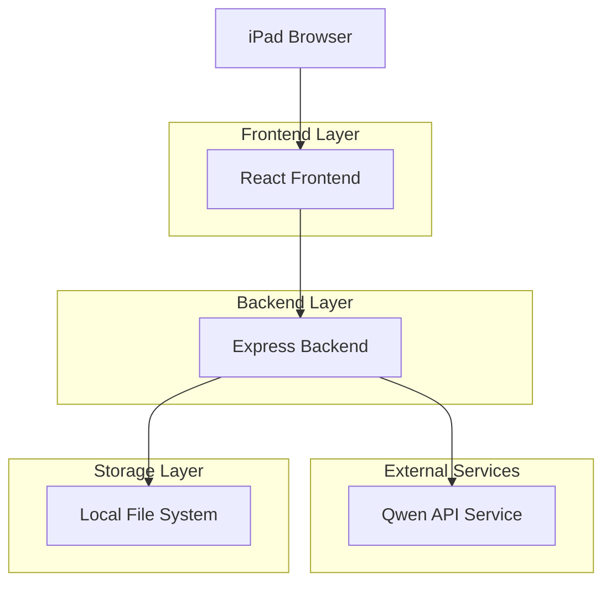
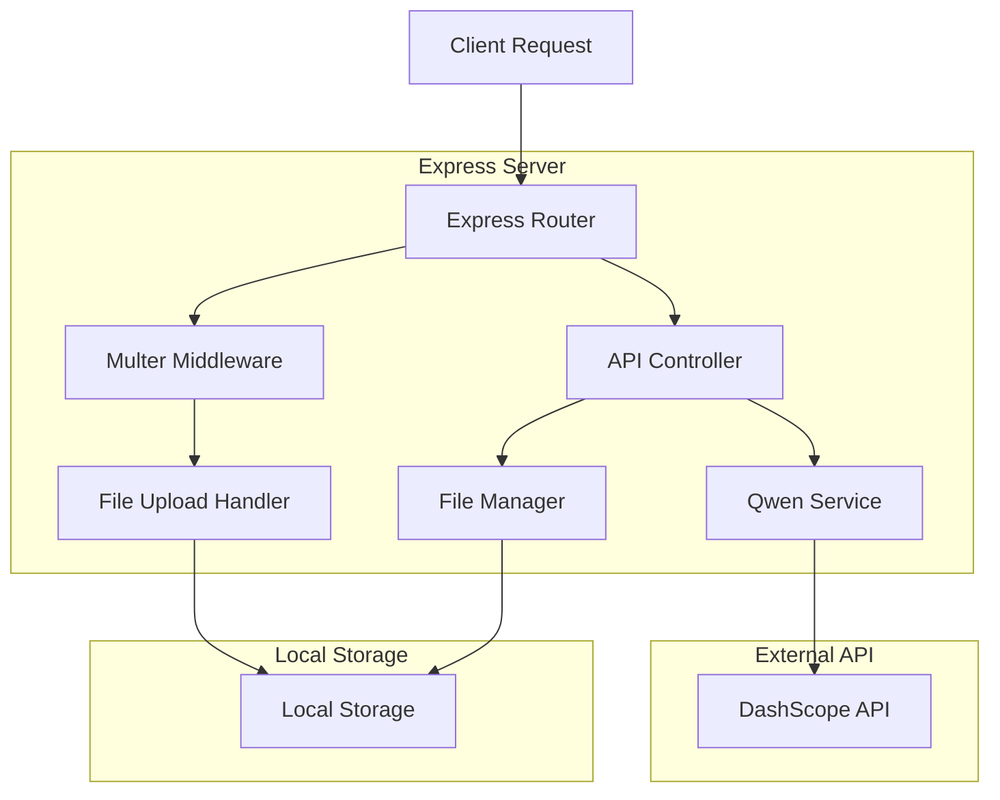

## 1. 架構設計



## 2. 技術描述
- **前端**: React@18 + tailwindcss@3 + vite
- **初始化工具**: vite-init
- **後端**: Node.js@18 + Express@4
- **文件存儲**: 本地文件系統
- **AI服務**: Qwen DashScope API

## 3. 路由定義
| 路由 | 用途 |
|-------|---------|
| / | 拍照主頁面，提供相機功能和朝代選擇 |
| /generate | 圖片生成頁面，顯示AI處理進度 |
| /result | 結果展示頁面，提供下載和分享功能 |
| /api/upload | 上傳原始照片到後端 |
| /api/generate | 調用Qwen API生成歷史服裝圖片 |
| /api/download/:id | 下載生成的圖片 |
| /api/share/:id | 獲取分享鏈接 |

## 4. API 定義

### 4.1 圖片上傳 API
```
POST /api/upload
```

Request:
| 參數名稱 | 參數類型 | 是否必需 | 描述 |
|-----------|-------------|-------------|-------------|
| image | File | true | 原始拍攝的照片 |
| dynasty | string | true | 選擇的朝代 (tang/song/ming/qing) |

Response:
| 參數名稱 | 參數類型 | 描述 |
|-----------|-------------|-------------|
| success | boolean | 上傳狀態 |
| imageId | string | 圖片唯一標識符 |
| message | string | 狀態描述 |

### 4.2 圖片生成 API
```
POST /api/generate
```

Request:
| 參數名稱 | 參數類型 | 是否必需 | 描述 |
|-----------|-------------|-------------|-------------|
| imageId | string | true | 上傳圖片的ID |
| dynasty | string | true | 目標朝代 |

Response:
| 參數名稱 | 參數類型 | 描述 |
|-----------|-------------|-------------|
| success | boolean | 生成狀態 |
| resultId | string | 生成結果ID |
| status | string | 處理狀態 (processing/completed/failed) |

### 4.3 獲取結果 API
```
GET /api/result/:resultId
```

Response:
| 參數名稱 | 參數類型 | 描述 |
|-----------|-------------|-------------|
| success | boolean | 請求狀態 |
| imageUrl | string | 生成圖片的訪問地址 |
| originalUrl | string | 原始圖片地址 |
| dynasty | string | 應用的朝代風格 |

## 5. 服務端架構圖



## 6. 數據模型

### 6.1 文件存儲結構
```
project-root/
├── uploads/          # 原始上傳照片
│   ├── tang/
│   ├── song/
│   ├── ming/
│   └── qing/
├── generated/        # AI生成照片
│   ├── tang/
│   ├── song/
│   ├── ming/
│   └── qing/
├── temp/            # 臨時文件
└── backup/          # 自動備份
```

### 6.2 元數據管理
使用JSON文件存儲圖片元數據：

```json
{
  "imageId": "unique-id",
  "originalPath": "/uploads/tang/original-123.jpg",
  "generatedPath": "/generated/tang/result-123.jpg",
  "dynasty": "tang",
  "uploadTime": "2024-01-29T10:00:00Z",
  "generateTime": "2024-01-29T10:01:30Z",
  "status": "completed"
}
```

## 7. 關鍵技術實現

### 7.1 相機集成
- 使用瀏覽器原生 `getUserMedia` API
- 針對iPad優化，支持前後鏡頭切換
- 圖片壓縮和格式優化

### 7.2 AI API集成
```javascript
// Qwen API調用示例
const generateHistoricalImage = async (imageBuffer, dynasty) => {
  const prompt = `將照片中的人物服裝更換為${dynasty}朝代的傳統服飾，保持人物面部表情和姿勢不變`
  
  const response = await fetch('https://dashscope-intl.aliyuncs.com/api/v1/services/aigc/multimodal-generation/generation', {
    method: 'POST',
    headers: {
      'Authorization': `Bearer ${API_KEY}`,
      'Content-Type': 'application/json'
    },
    body: JSON.stringify({
      model: 'qwen-vl-plus',
      input: {
        prompt: prompt,
        image: imageBuffer.toString('base64')
      }
    })
  })
  
  return response.json()
}
```

### 7.3 本地部署配置
- 使用環境變量管理API密鑰
- 配置文件支持不同網絡環境
- 自動創建必要的文件夾結構

```javascript
// 環境配置示例
const config = {
  port: process.env.PORT || 3000,
  apiKey: process.env.QWEN_API_KEY,
  uploadDir: process.env.UPLOAD_DIR || './uploads',
  generatedDir: process.env.GENERATED_DIR || './generated',
  maxFileSize: 10 * 1024 * 1024 // 10MB
}
```